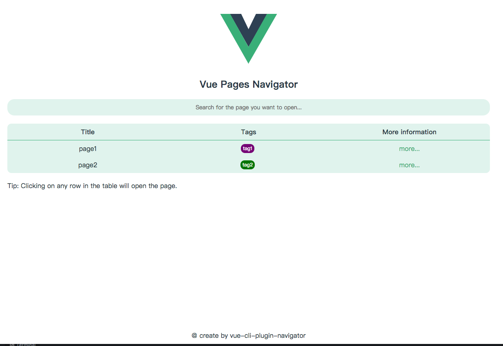
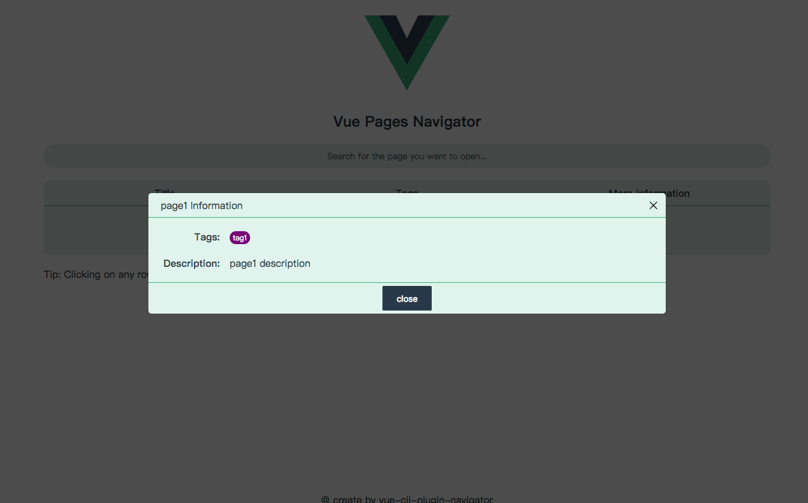
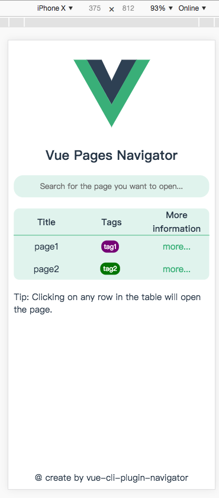
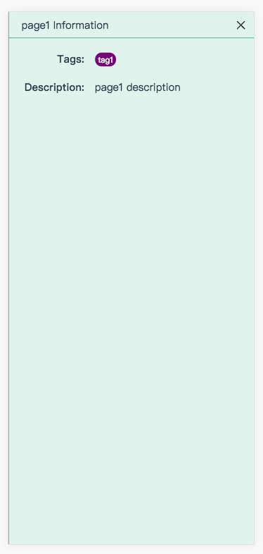

# vue-cli-plugin-navigator

Page navigation in a vue-cli 3.x multi-page mode.

This plugin will provide a homepage.

On the plugin's home page, it lists the pages you defined in vue.config.js. You can select a page that you want to open.

## usage

yarn:

```
yarn add vue-cli-plugin-navigator --dev
```

or npm:

```
npm i vue-cli-plugin-navigator --dev
```

## Configuration

This plugin has two personalized configurations,

Help you find your page better on the plugin homepage.

You can now assign tags and descriptions to your pages as you configure them.

example:

```
// vue.config.js
{
   ...other config
   pages: {
      page1: {
         entry: './src/page1.js',
         title: 'page1',
         filename: 'page1.html'
         tags: ['tag1'],  // This is the tags of the page, type is string[].
         description: 'page1 description'  // This is the description of the page, type is string
      },
      page2: './src/page2.js'
   },
   pluginOptions: {
      'navigator': {
         // Define your tags
         // Type is Tag[]
         defineTags: [
            {
               name: 'tag1',
               color: 'purple'
            },
            {
               name: 'tag2',
               color: 'green'
            }
         ]
      }
   }
}
```

## Example

-   config your project:


-   run your project on dev mode

Here is a screenshot of the plugin.

**on PC**




**on Mobile**



