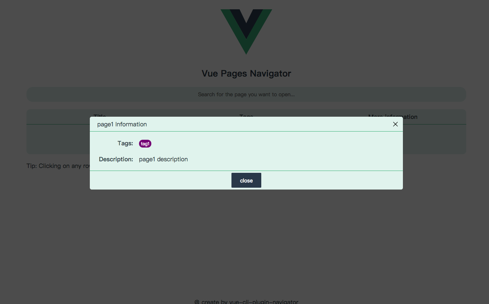

# vue-cli-plugin-navigator

[](https://travis-ci.org/longshihui/vue-cli-plugin-navigator) [](https://www.npmjs.com/package/vue-cli-plugin-navigator) [](https://www.npmjs.com/package/vue-cli-plugin-navigator) [](https://www.npmjs.com/package/vue-cli-plugin-navigator)

**vue-cli 3**多页面开发时的页面导航。

这个插件将提供一个主页。

在插件的主页上，它列出了您在 vue.config.js 中定义的页面。 您可以选择要打开的页面。

## 使用

**vue cli**

```
vue add navigator
```

**yarn**

```
yarn add vue-cli-plugin-navigator --dev
```

**npm**

```
npm i vue-cli-plugin-navigator --save-dev
```

## 配置

插件配置的命名空间是**navigator**。

这个插件有两个个性化配置，

帮助您在插件主页上更好地找到您的页面。

您现在可以在配置页面时为其分配标签和说明。

有关配置选项，请参阅[此文件](./lib/OptionsDefaulter.js)。

例子:

**vue.config.js**

```
{
   ...other config
   pages: {
      page1: './src/page1.js',
      page2: './src/page2.js'
   },
   pluginOptions: {
      navigator: {
         // 这里配置的标题将会展示在插件生成的主页上
         title: 'welcome'
         // 定义你可能用到标签
         // Tag 类型定义如下
         // {
         //    name: string,
         //    color: string,
         // }
         defineTags: [
            {
               name: 'tag1',
               color: 'purple'
            },
            {
               name: 'tag2',
               color: 'green'
            }
         ],
         // 如果一个页面没有被特别配置到插件的pages配置项
         // 它的配置信息将会继承defaults字段的信息
         defaults: {
            tags: [],
            description: 'none'
         }
         pages: {
             page1: {
                 tags: ['tag1'],  // 这个页面的标签, 类型是string[].
                 description: 'page1 description'  // 这个页面的描述信息，类型为string
             }
         }
      }
   }
}
```

## 例子

如果你有个 vue.config.js 配置如下

```
{
   pages: {
      page1: './src/page1.js',
      page2: './src/page2.js'
   },
   pluginOptions: {
      navigator: {
         title: 'Hello world'
         defineTags: [
            {
               name: 'tag1',
               color: 'purple'
            },
            {
               name: 'tag2',
               color: 'green'
            }
         ],
         defaults: {
            tags: ['tag2'],
            description: 'none'
         }
         pages: {
             page1: {
                 tags: ['tag1'],
                 description: 'page1 description'
             }
         }
      }
   }
}
```

在 dev mode 下运行你的项目

你将会看到如下截图内容

**在 PC 端**




**在移动端**


